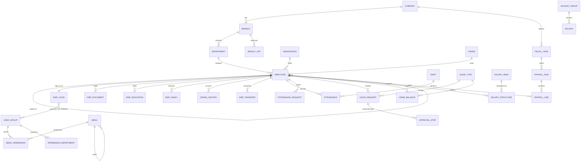

# HRMS Reverse Engineering Report — Phase 0

**Subject:** Nimble.Ananta HRIS/ERP (deployed 2022) → Bela-HRMS (`nimble-erp`)
**Date:** 18 September 2026
**Status:** Analysis complete. No rebuild work performed.

> **Superseded in part.** Milestone 0 (§25) has since been executed: the production database
> was restored and profiled. See **[`milestone-0-findings.md`](milestone-0-findings.md)**,
> whose §8 lists every correction to this document. The headline changes: the deployed schema
> is **705 tables, 465 of them empty**, not 993; **299 of the 453 stored procedures are
> recovered**, not lost; bug **B-2 is disproved** and **B-1 is overstated**; and **ten of the
> fourteen planned modules replace legacy modules that hold no production data**.

Every significant conclusion is tagged **OBSERVED** (confirmed directly from the
artefacts), **INFERRED** (reasonable from behaviour or code, not confirmed), or
**RECOMMENDED** (a proposal for the new system).

---

## 1. Executive summary

### 1.1 What was actually attached

Four things, and the relationship between them is the most important fact in this report:

| # | Artefact | What it is |
|---|---|---|
| 1 | `Nimble.Ananta.Host/` | A **deployed, binary-only** ASP.NET MVC 5 ERP. 29 module areas, 4,009 Razor views under `Areas/` (4,178 including `Views/`), 5,961 JavaScript files, ~161 assemblies. **No C# source.** |
| 2 | `Nimble.Ananta.Host/_revive/` | A prior recovery effort: a self-host, the EF Code-First model extracted to DDL + JSON, and a complete route/permission inventory. |
| 3 | `hrms_Live_2022_06_28_08.bak` | **A 1.49 GB SQL Server backup of the live production database**, dated 28 June 2022. |
| 4 | `nimble-erp/` | A **substantially advanced modern rebuild already in progress** — Next.js 16 / React 19 / TypeScript / Drizzle / PostgreSQL / Better Auth. 150 source files, 51 tables, 46 screens built. |

**OBSERVED.** The prompt frames this as "decide whether to clone, modernize or rebuild."
That decision has already been taken and executed to roughly a third of completion. The
useful question is not *which option* but *is the in-flight rebuild on the right track,
what is missing, and how does the production data get into it.*

### 1.2 The finding that changes the plan

**OBSERVED.** `_revive/README.md` states the recovery was blocked because "the database it
was built against was not included," and describes 453 stored procedures as
"not recoverable… they exist only in a customer's production database."

That database is now attached (artefact 3), and `SqlLocalDB.exe` is present on this machine
at `C:\Program Files\Microsoft SQL Server\150\Tools\Binn\`. The file header reads `TAPE`,
confirming a valid MS SQL backup set.

Restoring it unblocks, in one step, the four things currently blocking the rebuild:

1. The **453 stored procedures** — where the real business logic lives, since the module
   DLLs delegate to them. This is the only route to the payroll, appraisal and attendance
   calculation rules.
2. **Real data profiling** — actual cardinalities, enum values in use, data quality, which
   of the 993 tables are genuinely populated versus dead.
3. **Migration mapping** on real rows rather than inferred from DDL.
4. Very likely, **the legacy app running end to end** — `_revive` states plainly that the
   per-screen authorization failure is a data problem, not a code problem, and that
   restoring a real `NIMBLE_MIS_*` database should serve the whole application.

This is the single highest-value next action and it is currently untaken. See §25.

### 1.3 Assessment in one paragraph

The legacy system is a **large, genuine, feature-rich ERP** — 7,805 actions across 634
controllers — carrying a decade of Nepal-specific HR domain knowledge (Bikram Sambat
fiscal years, six-day weeks, SSF/PF, TADA, Darbandi). It is also structurally unsound in
ways that cannot be patched: currency stored as binary floating point across 736 columns,
993 tables with 99 declared relationships, roles stored as comma-separated strings, and a
permission system that is currently **failing closed on every business screen**. The
in-flight rebuild has diagnosed those failures precisely and designed against them; its
architecture is sound and its engineering quality is high. Its risk is not design — it is
**scope**: 46 of 103 declared screens, and the three largest legacy modules (Payroll, Fixed
Asset, Appraisal — 1,878 actions between them) are not started.

---

## 2. Existing technology stack

**OBSERVED** unless noted. Evidence is `web.config`, `packages.config`, `bin/`, `_revive/out/`.

| Technology | Current implementation | Evidence | Assessment |
|---|---|---|---|
| Runtime | .NET Framework 4.5 (`targetFramework="4.5"`) | `web.config` `<compilation>` | **Out of support.** 4.5 reached EOL Jan 2016. Windows-only. |
| Web framework | ASP.NET MVC 5.2.3 + Razor | `bin/System.Web.Mvc.dll`, `Global.asax` | Legacy; no async-first pipeline. |
| Language | C# — **compiled only, no source** | `Areas/*/lib/Nimble.Modules.*.dll` | **Critical.** Business logic is not readable. |
| Module system | Custom plugin host, 29 areas, `ModuleInfo.xml` per area, shadow-copied DLLs | `Nimble.Core.ModuleManager.dll`, `App_Data/installed_modules.xml` | Genuinely modular for its era; the good idea worth keeping. |
| Database | SQL Server; 28 EF `DbContext`s; **453 stored procedures** | `_revive/out/model.json`, `stored_procedures_required.json` | Procedures hold logic not present in the assemblies. |
| ORM | Entity Framework 6 Code First, plus Dapper | `bin/EntityFramework.dll`, `bin/Dapper.dll` | Two data-access styles in one app. |
| Auth | ASP.NET Forms Authentication + custom `EmpLogin` table | `web.config` `<authentication mode="Forms">` | Custom scheme, see §11. |
| Authorization | DB-driven menu tree + `MenuPermission` grid + group-type floor | `Menu`, `MenuPermission`, `UserGroup` DDL | **Currently broken** — see §11.4. |
| UI framework | AdminLTE 2 + Bootstrap 3 + jQuery 3.5.1 | `Views/Shared/_Layout.cshtml` (`skin-blue-light`, `sidebar-mini`) | Dated but coherent. |
| Component libs | Ext.NET, GridMvc / Grid.Mvc.Ajax, Handsontable, BeginCollectionItem, CaptchaMvc | `bin/`, `packages.config` | Ext.NET is commercially licensed and a hard migration blocker. |
| State management | Server session (`InProc`, 20 min) + jQuery DOM state | `web.config` `<sessionState mode="InProc">` | `InProc` prevents horizontal scaling. |
| API architecture | MVC actions returning mixed types — 3,153 `ActionResult`, 2,233 `ContentResult`, 1,303 `PartialViewResult`, 310 `JsonResult`, 430 `void` | `_revive/out/routes.csv` | No API contract. Largely HTML-fragment RPC. |
| File storage | Local disk under the web root — `Documents/` (13 MB in this copy) | directory listing | See §10, finding S-04. |
| Email | `SendMail` actions (20) present; provider not identifiable from binaries | `routes.csv` | **INFERRED:** SMTP via config. |
| Background jobs | MSMQ directory present (`msmq/`); no scheduler assembly found | directory listing | **INFERRED:** queue-based async, lightly used. |
| Caching | `Nimble.Core` caching + a *Clear Cache* admin screen | `Areas/Security/Views/Update/ClearCacheConfirmed.cshtml` | In-process. |
| Reporting | Crystal Reports, SSRS ReportViewer, EPPlus, OpenXML, PdfSharp, HTMLReportEngine | `bin/` | **Four** reporting engines. Crystal is licensed and Windows-bound. |
| Testing | **None found** | no test assemblies or projects | Zero automated coverage. |
| Build | MSBuild; modules shipped as `.zip` packages installed via an in-app screen | `Areas/Security/Views/Update/InstallModule.cshtml` | Self-updating app — clever, and a security concern. |
| Deployment | IIS on Windows; multi-tenant by hostname→database map in an XML file | `App_Data/tenant_db.xml` | Tenancy in a file on disk. |

### 2.1 Target stack (the in-flight rebuild)

**OBSERVED**, from `nimble-erp/package.json`:

Next.js 16.3.4 (App Router, Server Components, Server Actions) · React 19.2.8 ·
TypeScript 5 · Drizzle ORM 0.45 · PostgreSQL · Better Auth 1.7 · Zod 4 · Tailwind 4 ·
TanStack Table · lucide-react · pnpm 10.

No REST/GraphQL layer, no component library, no client state manager. Deployment is Docker
Compose — Postgres + app + Caddy — on a private VPS.

---

## 3. Complete module inventory

**OBSERVED.** Counts are from `_revive/out/routes.csv` (7,805 rows) and a view census of
`Areas/`. "Controllers" counts distinct (Area, Controller) pairs.

| Area | Actions | Controllers | Views | Rebuild status |
|---|---:|---:|---:|---|
| Hrm | 940 | 79 | 657 | Partial — Employees, Reporting Lines |
| FixedAsset | 828 | 57 | 261 | Not started |
| Payroll | 604 | 45 | 354 | Port contract only (`payableDays()`) |
| Attendance | 546 | 39 | 235 | **7 of 10 screens built** |
| Common | 543 | 59 | 279 | Absorbed into `setup` / `kernel` |
| Inventory | 490 | 19 | 149 | Not started |
| ProjectManagement | 465 | 47 | 195 | Out of declared scope |
| Appraisal | 446 | 30 | 268 | Not started |
| Leave | 336 | 24 | 132 | **7 of 9 screens built** |
| StaffAdvance | 312 | 25 | 152 | Folded into `expense` (planned) |
| CoreExtension | 299 | 34 | 127 | Absorbed into `kernel` |
| TravelOrder | 232 | 20 | 103 | Planned (`travel`) |
| StaffInsurance | 214 | 16 | 84 | Not started |
| ExpenseClaim | 197 | 17 | 69 | Planned (`expense`) |
| Training | 160 | 15 | 60 | Planned |
| Grievance | 136 | 9 | 115 | Not started |
| TaskManager | 136 | 18 | 65 | Not started |
| ContractManagement | 121 | 6 | 106 | Not started |
| Reporting | 107 | 11 | 64 | **Not started — see §20** |
| Misc | 103 | 7 | 55 | — |
| Security | 89 | — | 49 | Rebuilt as `admin` |
| SelfService | 73 | — | **0** | **Rebuilt as `self` / My Desk** |
| FixedAssetUtilities | — | — | 191 | Not started |
| MenuManagement | 59 | — | 27 | **Deliberately eliminated** (§14.3) |
| OnlineExamination | — | — | 38 | Out of scope |
| StaffExitProcess | — | — | 42 | Not started |
| TicketManagement | — | — | 28 | Not started |
| Administration | — | — | 104 | Rebuilt as `admin` |
| Recruitment | 2 | — | **0** | Not started |

**OBSERVED — incomplete in the legacy system itself.** `Recruitment` has 2 actions and 0
views; its package is 62 KB. `SelfService` has 73 actions and 0 deployed views; its package
is 46 KB, the smallest shipped. Both are stubs, not working modules. Anything the business
believes it has in recruitment or self-service today is **INFERRED** to be manual.

**OBSERVED — two modules cannot even load.** `_revive` reports `StaffInsuranceContext` and
`TaskManagerContext` fail to instantiate, having been built against an older
`Nimble.Modules.Common`; both are absent from `installed_modules.xml`. That is 350 actions
of declared functionality that is not running in production.

### 3.1 The new system's declared inventory

**OBSERVED**, from `src/modules/registry.ts`: **15 modules, 103 navigation items, 69
permissions**. 46 items are `ready()`, 57 are `planned()`.

> **Documentation drift, already.** `README.md` states "88 screens" and "thirty-one screens
> built"; the registry — which the README itself calls the product spec — declares 103 and
> 46. The registry is the source of truth; the README is stale. Worth fixing before it
> becomes the legacy system's habit.

---

## 4. Navigation architecture

**OBSERVED.** The legacy menu is a four-level tree resolved at render time from database
rows, in `Views/Shared/_Layout.cshtml`:

```
MenuManager.ParentMenu(area, controller, action, 1) → RootMenu   (top bar, module group)
                                              ... 2) → TopMenu    (module)
                                              ... 3) → LeftMenu   (sidebar section)
                                              ... 4) → CurrentMenu (leaf, only if LeftMenu has children)
```

Each `Menu` row carries `MenuID`, `UnderMenuID` (self-referencing parent), `ModuleID`,
`MenuLevel`, `DisplayOrder`, `Icon`, `AreaName`/`ControllerName`/`ActionName`, and
`ForLoginMode`. Visibility is filtered by `MenuPermission` for the user's group.

```mermaid
graph TD
    Root["Root menu (module group)"] --> HRM[HRM]
    Root --> FIN["Finance / Assets"]
    Root --> ADMIN[Administration]

    HRM --> EMP[Employee]
    HRM --> ATT[Attendance]
    HRM --> LV[Leave]
    HRM --> PAY[Payroll]
    HRM --> APR[Appraisal]

    EMP --> EMP_L[Employee List]
    EMP --> EMP_P[Employee Profile]
    EMP --> EMP_D[Employee Documents]
    EMP --> EMP_T[Transfer / Promotion]

    ATT --> ATT_D[Daily Attendance]
    ATT --> ATT_R["Requests: correction / late-early / OT"]
    ATT --> ATT_S[Shift &amp; Roster]
    ATT --> ATT_AP[Approvals]

    LV --> LV_R[Leave Request]
    LV --> LV_A[Leave Approval]
    LV --> LV_B[Leave Balance]
    LV --> LV_T[Leave Types]

    PAY --> PAY_S[Salary Structure]
    PAY --> PAY_P[Payroll Run]
    PAY --> PAY_L[Payslips]

    ADMIN --> SEC_U[Users]
    ADMIN --> SEC_G[User Groups / Roles]
    ADMIN --> SEC_P[Menu Permission]
    ADMIN --> SEC_M[Modules &amp; Licensing]
    ADMIN --> SEC_A[Audit Trail]
```



**INFERRED.** The exact leaf set above is reconstructed from `routes.csv` and the view
census, not from live menu rows — the shipped `Menu` seed is from 2016 and does not match
the 2022 build (§11.4), so no authoritative live tree exists in the package.

### 4.1 Role- and mode-based navigation

**OBSERVED.** Three independent filters narrow the menu:

1. `MenuPermission` per `UserGroupID` × `MenuID`, with six flags: `FullAccess`, `AllowAdd`,
   `AllowEdit`, `AllowDelete`, `AllowView`, `AllowPrint`.
2. `Menu.ForLoginMode` against `LoginModes` — Admin = 1, SelfService = 2, All = 10.
3. `UserGroup.ModuleIDs` (a CSV string) and `Modules.IsActive`/`IsInstalled`/`IsLive`/`License`.

**Preserve the logical menu/submenu relationships** — the rebuild does, and its
`src/modules/registry.ts` maps legacy areas onto 15 modules with sections retained.

---

## 5. User roles

**OBSERVED**, from `UserGroupType` / `UserGroup` and the `MinGroupType` column of
`routes.csv`:

| Group type | Actions gated at this floor | Meaning |
|---|---:|---|
| SuperAdmin | 170 | System owner; updates, modules, licensing |
| Admin | 259 | Tenant administrator |
| Supervisor | 72 | Approver in the reporting line |
| User | 2,633 | Back-office / HR operator |
| Employee | 276 | Self-service only |
| All | 2,599 | Any authenticated principal |
| *(none)* | **1,796** | **No attribute at all — see §10, finding S-01** |

Roles are *instances* of a group type: `UserGroup.group_type_id` → `UserGroupType`, so a
tenant defines its own named roles and each inherits a floor. **OBSERVED.**

`LoginSourceTypes` is a separate axis: `Employees = 0, Admins = 1, LDAPEmployees = 2,
LDAPAdmins = 3` — LDAP is supported (`EmpLogin.AdDomainUser`, `UserList.AuthServerLoginID`).

---

## 6. Permission matrix

**OBSERVED.** The legacy model is a six-flag grid per (role × menu item), so the matrix is
per-tenant data, not a shipped fact. The *verb vocabulary* is fixed by the code:

| Permission verb | Actions using it |
|---|---:|
| View | 1,936 |
| Edit | 1,434 |
| Add | 1,154 |
| Delete | 840 |
| Print | 484 |
| FullAccess | 104 |
| Anonymous | 57 |
| *(none)* | 1,796 |

**Representative matrix, as the product is designed to be configured** — INFERRED from the
route inventory, since live grants are in the un-restored database:

| Resource | Create | Read | Update | Delete | Approve | Print |
|---|:---:|:---:|:---:|:---:|:---:|:---:|
| Employees | HR | HR, Supervisor (team), Self (own) | HR | Admin | — | HR |
| Attendance | HR, Device | HR, Supervisor (team), Self (own) | HR | — | Supervisor | HR |
| Attendance correction | Self | Self, Supervisor | Self (pre-approval) | — | Supervisor → HR | — |
| Leave request | Self | Self, Supervisor, HR | Self (pre-approval) | — | Supervisor → Manager | — |
| Leave types / policy | HR | All | HR | Admin | — | — |
| Payroll run | Payroll | Payroll, Finance | Payroll | — | Finance | Payroll |
| Payslip | — | Self (own), Payroll | — | — | — | Self |
| Users / Roles | Admin | Admin | Admin | Admin | — | — |
| Modules / Licensing | SuperAdmin | SuperAdmin | SuperAdmin | — | — | — |

**Data scoping is a third dimension** and is real: `PermissionDepartment`,
`PermissionOutSourceOrg` and `PermissionWidget` restrict a role to specific departments,
outsourcing organisations and dashboard widgets. `GroupPermission` views also carry
`_BranchWisePermission` and `_BusinessUnitWisePermission` partials. **OBSERVED.**

> **RECOMMENDED.** The rebuild currently has role→permission grants but **no equivalent of
> `PermissionDepartment` / branch-wise scoping**. For a multi-branch manufacturer this is a
> functional requirement, not a nicety: an HR officer at one plant should not read another
> plant's salaries. This is the most significant *functional* gap in the new RBAC. See §25.

---

## 7. Business workflows

**OBSERVED.** 354 actions across 79 distinct controllers match
`approve|reject|forward|verify|authorize|recommend|cancel|revert|withdraw`. The
distribution is the key structural finding:

| Area | Approval actions | Area | Approval actions |
|---|---:|---|---:|
| FixedAsset | 53 | ExpenseClaim | 23 |
| Payroll | 44 | StaffAdvance | 14 |
| Leave | 43 | Appraisal | 13 |
| Inventory | 36 | TaskManager | 10 |
| Attendance | 32 | Grievance | 9 |
| Hrm | 29 | *13 more areas* | 48 |

**79 controllers implement approval independently.** There is one generic engine
(`CoreExtension/ProcessFlowDetail`, and `Common/DataApproval`) but it plainly did not win —
`Leave/LeaveRequest`, `Attendance/AttendanceRequest`, `Attendance/OverTimeRequest`,
`Attendance/LateEarlyRequest`, `ExpenseClaim/EmployeeExpenseClaim`,
`FixedAssetUtilities/AssetRequisition`, `Hrm/EmpTransferRequest` and 70-odd others each
carry their own copy of the same state machine. **OBSERVED.**

### 7.1 Leave request — end to end

**INFERRED** from view names, action names and the `LeaveContext` schema (61 tables). The
authoritative rules are in stored procedures not yet recovered.

```
Employee
   ↓ submits (leave type, from, to, half-day flag, reason, attachment)
Validation      entitlement exists for employment type · balance ≥ days
                · no overlap with an existing request · within notice period
                · working days only (weekly off + holiday group excluded)
   ↓
DB change       LeaveRequest row, status = Pending; balance reserved
   ↓
Routing         levels sized from day count against the leave type's per-level cap
   ↓
Approval        Supervisor → (Manager) → HR.  Reject releases; Forward escalates
   ↓
Notification    in-app + SendMail to requester and next approver
   ↓
Effects         attendance days marked on_leave · payroll paid-percent applied
   ↓
Audit           AuditTrail row via the trigger registry (§18)
```

### 7.2 Attendance correction

```
Employee raises a correction / late-early / overtime request against a specific date
   ↓ validation: the day is not in a locked period; a shift is assigned
Supervisor approves  →  attendance day recalculated  →  monthly sheet and payroll inputs change
```

**OBSERVED** that these are three *separate* controllers with three separate approval
implementations (`AttendanceRequest`, `LateEarlyRequest`, `OverTimeRequest`).

### 7.3 Employee lifecycle

**OBSERVED** from `Areas/Hrm/Scripts/` — the script directory names enumerate the
workflows precisely: `employee`, `education`, `family`, `document`, `EmployeeTransfer`,
`GradeHistory`, `EmpSkillSet`, `EmployeeRequisition`, `EmpRelativeDeclaration`,
`HealthDetail`, `EmployeeLanguageDetail`, `award`, `DesciplinaryActionTypes`,
`DepartmentClearanceResponse`, `AuthorityDelegation`, `EmployeeSurvey*` (12 separate
survey controllers), `ExitSurvey`, `BondType`, `HomeLoanAddress`, `CommitteeRolesMaster`.

```
Requisition → Approval → Recruitment(stub) → Create employee
  → Assign branch · department · designation · grade · service · reporting manager
  → Create EmpLogin + assign UserGroup
  → Upload documents (contract, citizenship, PAN, academic)
  → Probation → Confirmation → (Transfer | Promotion | Grade change)
  → Resignation / Termination → Department clearance → Exit survey → Final settlement
```

**INFERRED** on ordering; **OBSERVED** that each named step has a controller and views.

### 7.4 Workflows the rebuild has implemented

**OBSERVED**, and verified by executable checks rather than claims — `pnpm check:leave`
(23 assertions), `check:attendance`, `check:org`, `check:isolation`, `check:self`,
`check:pagination`. Leave submission reserves balance under a row lock *before* checking
it, and approval publishes `leave.request.approved` into a `domain_events` table that
attendance subscribes to. That is a materially better design than 79 copies of a state
machine.

---

## 8. UI/UX analysis

**OBSERVED**, from `Views/Shared/_Layout.cshtml` and the 48 shared partials.

| Aspect | Legacy implementation |
|---|---|
| Shell | AdminLTE 2 — fixed header, collapsible left sidebar (`sidebar-mini`), footer |
| Theme | `skin-blue-light` for Admin mode, `skin-green-light` for Self-Service — **login mode is visually encoded**, a genuinely good idea |
| Branding | Header/footer colour configurable per tenant (`System_HeaderFooterColorCode`, comma-separated pair) |
| Tables | GridMvc / Grid.Mvc.Ajax with server-side paging, sorting, filtering; user-configurable columns (`AddColumns.cshtml`, `EditColumns.cshtml`) |
| Data entry | Razor forms + Ext.NET widgets + Handsontable for grid entry |
| Modals | jQuery/Bootstrap modals and `_IframePopup.cshtml` — **iframe-based popups** |
| Loading | Global `#overlay` spinner toggled by `OverlayOn()` |
| Messages | `_TopMessageDisplay`, `Success.cshtml`, `Messages/` partials |
| Empty/error | `NoPermission.cshtml`, `NotFound.cshtml`, `PageExpired.cshtml`, `Error.cshtml` |
| Session | Heartbeat poll (`Security_HeartbeatInterval`) + `handleIsSessionExist()` |
| Dates | Nepali (Bikram Sambat) date picker throughout; footer shows the BS date |
| Reports | Crystal / SSRS viewer embedded; export to Excel and PDF (304 `Export` actions) |

### 8.1 Responsive behaviour

**OBSERVED.** The viewport tag is:

```html
<meta content="width=device-width, initial-scale=1, maximum-scale=1, user-scalable=no" name="viewport">
```

`maximum-scale=1, user-scalable=no` **disables pinch-zoom**. That is a WCAG 1.4.4 failure
and, on a data-dense ERP, a practical accessibility problem for anyone with low vision.

**INFERRED** (from the component choices, not from running the UI at each breakpoint):

| Viewport | Expected behaviour |
|---|---|
| Desktop ≥1200px | Designed target. Fine. |
| Laptop 1024–1199px | Fine; sidebar auto-collapses to mini. |
| Tablet 768–1023px | AdminLTE collapses the sidebar off-canvas. Wide grids overflow horizontally. |
| Mobile <768px | **Poor.** GridMvc tables with 15–30 columns, Ext.NET widgets and iframe modals are not mobile-viable. Zoom is disabled, so the usual workaround is blocked too. |

A 365-column `vwEmployeeInfo` and a 160-column `vwMonthlySalarySheet` are not going to
render usefully on a phone under any CSS.

### 8.2 The rebuild's UI

**OBSERVED.** Tailwind 4, no component library, hand-built primitives in
`src/components/ui.tsx`, themed SVG charts (`charts.tsx`), a collapsible module tree with
search, rail mode, breadcrumbs and per-module badges. Preferences read through
`useSyncExternalStore` to avoid hydration mismatch. Light/dark themed. Planned screens are
real routes marked `soon`.

---

## 9. Database analysis

**OBSERVED**, computed from `_revive/out/model.json` (28 contexts, EF Code-First model
extracted from the compiled assemblies):

| Metric | Value |
|---|---:|
| `DbContext`s | 28 |
| Table definitions across contexts | 1,424 |
| **Distinct tables** | **993** |
| Tables defined in more than one context | 219 |
| **Declared associations (FKs) in the model** | **99** |
| Total columns (distinct tables) | 18,124 |
| **Nullable columns** | **13,900 (77%)** |
| Base (non-view) tables | 921 |
| Base tables with a primary key | 921 (100%) |
| Base tables with an identity column | 572 |
| Stored procedures called by code | **453** |

### 9.1 The five structural defects

**D-1 — Currency as binary floating point. OBSERVED, and the most serious.**
Of ~1,300 columns whose names indicate money or rates
(`amount|salary|rate|wage|basic|allowance|deduct|tax|bonus|pay|gross|net|total|balance`):

| Type | Columns |
|---|---:|
| **float** | **736** |
| int | 192 |
| nvarchar | 101 |
| decimal | 76 |
| money | 69 |
| nvarchar(max) | 44 |
| numeric | 31 |

Examples: `apr_ScheduleEmpRelation.CurrentSalary`, `apr_ScheduleEmpRelation.SalaryRecAmt`,
`vwEmployeeInfo.JoinSalary`, `apr_ResultCompilation.SalaryRecAmtAdj`. `float` is IEEE-754
binary — 0.1 is not representable, and sums over a payroll of hundreds of employees
accumulate error. Any payroll report that fails to reconcile by a few paisa has this as its
root cause. **101 money-ish columns are stored as text**, which is worse.

**D-2 — Almost no referential integrity. OBSERVED.** 99 associations for 993 tables. The
merged DDL emits 89 foreign keys. Relationships are maintained in application code, or not
at all. `_revive` documents the concrete consequence: `UnderGroup = 0` stored for a root
node with no FK, allowing a business unit to be parented to a project, after which the
structure report recursed until it timed out.

**D-3 — Relations stored as delimited strings. OBSERVED.**
`EmpLogin.RoleIDs nvarchar(max)`, `UserList.UserGroupIDs nvarchar(max)`,
`UserGroup.ModuleIDs nvarchar(max)`, `Modules.GroupID varchar(max)`,
`Menu.UnderMenuID varchar(max)`. Un-joinable, un-indexable, un-constrainable. `Menu.MenuID`
is `varchar(128)` but `Menu.UnderMenuID` is `varchar(max)` — the parent key is a different
type from the primary key it points at.

**D-4 — Type mismatches across joins. OBSERVED.** `EmpLogin.ParentPkID` is `nvarchar(30)`
and points at `UserList.UserID`, an `int`. Every such join is an implicit conversion, which
in SQL Server discards index seeks.

**D-5 — Inconsistent audit and soft-delete. OBSERVED**, across 921 base tables:

| Concern | Tables | Coverage |
|---|---:|---:|
| Created stamp (`CreatedOn`/`AddedOn`/`CreatedDate`) | 333 | 36% |
| Modified stamp (`ModifiedOn`/`UpdatedOn`) | 267 | 29% |
| Soft delete (`DeletedOn`/`DeletedBy`/`IsDeleted`) | 65 | **7%** |
| Active/status flag | 169 | 18% |

Three competing naming conventions for the same concept (`CreatedBy` 255, `AddedBy` 83,
`ModifiedBy` 298). 93% of tables hard-delete. For payroll and leave records, that is a loss
of history that cannot be reconstructed.

Also **OBSERVED**: `nvarchar(max)` is used 1,921 times and `float` 1,417 times — both far
beyond what the data warrants; `Settings` has 110 columns; `vwEmployeeInfo` has 365.

### 9.2 Conceptual ER diagram — HR core

**OBSERVED** entities; cardinalities **INFERRED** from naming and context membership.



### 9.3 The rebuild's schema — RECOMMENDED direction, already taken

**OBSERVED**, from `drizzle/*.sql` (7 migrations):

| Metric | Legacy | Rebuild |
|---|---:|---:|
| Tables | 993 | 51 |
| Declared foreign keys | 89–99 | **109** |
| Indexes | *(not in the model)* | 41 |
| `numeric` columns | 31 | **20** |
| `float`/`double precision` columns | 1,417 | **0** |

**More foreign keys on 51 tables than the legacy system has on 993.** Zero floating-point
columns. That is the correct answer to D-1 and D-2 and it is already implemented.

---

## 10. API analysis

**OBSERVED.** There is no API tier. 7,805 MVC actions return HTML, HTML fragments, raw
content, or JSON interchangeably. Only 77 actions return `IHttpActionResult` (Web API).

| Verb | Actions |
|---|---:|
| GET (incl. `Get`) | 5,610 |
| POST | 2,193 |
| DELETE | 2 |
| PUT / PATCH | 0 |

Deletion is done by POST to `DeleteConfirmed` (237 actions) rather than by HTTP DELETE.
`Export` (304), `GetData` (183), `DownloadFile` (61) and `Import` (12) are the bulk-data
paths.

### API findings

| ID | Finding | Evidence | Assessment |
|---|---|---|---|
| A-1 | **1,796 actions carry no permission attribute** — 23% of the surface. 430 of them are POST. | `routes.csv` `Permission` column empty | **Critical.** See S-01. |
| A-2 | **913 of 2,193 POST actions have no anti-forgery token** (42%) | `AntiForgery` column | **High.** See S-02. |
| A-3 | No pagination contract — paging is a GridMvc concern per screen | view census | Inconsistent; some grids load unbounded. |
| A-4 | No versioning, no OpenAPI, no uniform error envelope | absence | Cannot support mobile or integrations. |
| A-5 | 430 actions return `void` | `Returns` column | No status contract at all. |

**RECOMMENDED.** The rebuild's answer — Server Components read, Server Actions write, no
transport layer — removes A-3/A-4/A-5 by construction. **However:** an ERP will eventually
need a machine-to-machine surface (biometric attendance devices, bank payment files,
accounting export). The legacy system has `RealandAPI.dll`, `Riss.Devices.dll` and
`Interop.zkemkeeper.dll` for **biometric device integration** — that is real, in use, and
has no equivalent in the rebuild. Plan a narrow authenticated REST surface for devices and
integrations; do not plan a general API.

---

## 11. Authentication analysis

**OBSERVED**, from `web.config`, the `EmpLogin`/`UserList` DDL, and `_revive/README.md`
(which documents the scheme from the shipped `nimbleJS.js` and `PwTool.exe`).

### 11.1 The scheme

1. **Client side.** The browser encodes the password before posting:
   `hash = btoa("B" + seed + "B") + btoa(password)`, then replaces the first `=` with
   `XCBX`. `seed` is a `RandomSeed` hidden field. **This is Base64, not hashing** — it is
   reversible and provides no protection whatsoever.
2. **Server side.** `SecurityServices.GetPasswordStringToHash(password, loginID)` builds
   `"<loginID>-<password>-KRG-CSS-HRM"` — a **hard-coded pepper compiled into the
   assembly** — and `EncryptPassword` hashes it with a random salt, producing an 88-char
   Base64 string. `bin/BCrypt.Net-Next.StrongName.dll` is present, so the underlying
   primitive is **INFERRED** to be BCrypt, which would be adequate.
3. **Storage.** `EmpLogin.LoginPassword nvarchar(255)`, keyed by `LoginForSource`
   (`LoginSourceTypes`). `UserList` is the legacy table; `UserList.password` is declared
   `nvarchar(50)` while the hash is 88 characters — **a schema/code mismatch the recovery
   had to widen to make login work at all**. OBSERVED.
4. **Session.** Forms auth cookie + `InProc` session, 20-minute timeout, heartbeat poll.

### 11.2 Supporting flows — all OBSERVED

Login, Login-to-MIS, Employee login, Logout, Change password, Change admin password,
Forgot password, Reset password (with `InvalidResetToken` handling), **OTP generation**,
user profile, LDAP/AD binding (`AdDomainUser`, `AuthServerLoginID`), account lock
(`locked_status`), validity window (`valid_from`/`valid_to`), forced password change
(`PWChangeStatus`, `PasswordChangedDate`), and login logging (`LoginLogID` on 64 tables).

That is a **more complete authentication feature set than the rebuild currently has** (§15.4).

### 11.3 Authorization

Three checks compose: `MinGroupType` floor → `MenuPermission` verb flag → module
installed/licensed. Data scope adds `PermissionDepartment` / branch / business-unit.

### 11.4 The production failure

**OBSERVED**, from `_revive/README.md` and confirmed by the shape of `50_menu_rebuild.sql`
and `40_modules_and_permissions.sql`:

> Every guarded page answers *"You have no permission to access requested contents."*

Two causes. Confirmed: the shipped `Menu` seed is from 2016 and its 195 rows hang off
parents the 2022 modules no longer define — `menu.setup.organization.department` has
`UnderMenuID = 'menu.organization.structure'`, and no such row exists. The tree cannot be
walked, so the permission filter denies everything. Secondary: `Menu.ForLoginMode` defaulted
to `0`, matching no `LoginModes` value, producing *"Appropriate role without module and menu
bound is not found for login mode."* Likely (unconfirmed, needs a vendor licence key):
`LicenseManager.VerifyModuleLicense` gates the module list and `Modules.License` is NULL on
every row.

**This is the defining lesson of the whole exercise.** A permission system whose *catalogue
and tree* live in mutable data, while the code that defines them ships separately, will
drift — and when it drifts it fails closed across the entire product. The rebuild's decision
to compile the catalogue and the tree into the build, storing only grants as data, is the
correct structural response. **OBSERVED** that it is implemented
(`src/modules/registry.ts`, `isKnownPermission()` in `src/lib/session.ts`, which ignores an
unknown grant rather than failing).

---

## 12. Security audit

Severity is CVSS-flavoured judgement, not a scored assessment. No destructive or intrusive
testing was performed; findings are from static inspection of configuration, DDL, views and
the route inventory.

### 12.1 Legacy system

| ID | Severity | Finding | Location | Evidence | Risk | Recommendation |
|---|---|---|---|---|---|---|
| **S-01** | **Critical** | **1,796 actions (23%) declare no permission; 430 are POST.** | across all areas | `routes.csv` `Permission` empty | Broken access control (OWASP A01). An authenticated low-privilege user reaching these URLs directly is **INFERRED** to be unchecked beyond authentication. | Deny-by-default: every action requires an explicit permission; no attribute = no access. |
| **S-02** | **High** | **913 of 2,193 POST actions lack anti-forgery validation (42%).** | across all areas | `routes.csv` `AntiForgery` empty | CSRF (A01). State-changing requests forgeable from another origin. | Global anti-forgery filter, opt-out by exception. |
| **S-03** | **High** | **Database credentials in cleartext in `web.config`**, committed: `user id=DEV;password=DEV$HRM@NIMBLE#I` on `192.168.10.6\SQL08`. | `web.config` connectionStrings | direct read | Credential disclosure (A07). Anyone with repo or file-system read owns the database. | Secrets from environment / a vault; rotate this credential now — it is in a shared archive. |
| **S-04** | **High** | **Employee documents stored under the web root** at `Documents/EmployeeDocument/`, `Documents/Hrm/EmployeeImages/`, with **no directory-level `web.config`**. Filenames are 40-char random tokens. | directory listing; no `web.config` found under `Documents/` | direct read | Sensitive data exposure (A01/A02). Because `runAllManagedModulesForAllRequests="true"`, Forms *authentication* is **INFERRED** to apply; *authorization per document is not enforced at all*, so any authenticated user with a filename retrieves any employee's contract, citizenship or medical record. Security rests on filename entropy. | Move the store outside the web root; serve through an authorizing handler that checks the requester against the document's owner. |
| **S-05** | **High** | **`debug="true"` in the deployed `web.config`**, with a `TODO in Production` comment beside it. | `<compilation debug="true">` | direct read | Verbose errors, no request timeout, degraded performance, larger attack surface (A05). | `debug="false"`; fail the build if it is true. |
| **S-06** | **High** | **Content-Security-Policy includes `'unsafe-inline'` and `'unsafe-eval'`.** 1,681 views contain inline `<script>`, so the policy cannot be tightened without rewriting them. | `web.config` customHeaders; view census | direct read | CSP provides close to no XSS mitigation as configured (A03). | Externalise scripts; nonce-based CSP. Large effort — an argument for the rebuild. |
| **S-07** | **High** | **1,184 `Html.Raw()` calls across 900 views.** | `Areas/**/*.cshtml` | grep count | Stored XSS (A03) wherever any of those renders user-supplied data. `AntiXssEncoder` is configured for normal output, which is good — `Html.Raw` bypasses it. | Audit every call; sanitise with `HtmlSanitizer` (already in `bin/`) or remove. |
| **S-08** | **High** | **453 stored procedures, unreviewed.** Dynamic SQL is evidenced by `sp_GetParentTableInfoForLoginDynamic`. | `stored_procedures_required.json` | inventory | SQL injection (A03) cannot be excluded and cannot be assessed without the procedure bodies. | **Restore the backup and review all 453.** See §25. |
| **S-09** | **Medium** | **In-app module installation** (`InstallModule`, `SystemUpdate`, `DatabaseUpdate`, `RestartAppDomain`) uploads and loads arbitrary assemblies. | `Areas/Security/Views/Update/` | view names | Remote code execution if a SuperAdmin account is compromised (A08). | Remove from the product; deploy through the pipeline. |
| **S-10** | **Medium** | **680 file-related actions; 118 carry no permission.** `DownloadFile` alone is 61 actions. | `routes.csv` | filter | Path traversal / IDOR (A01) — unverified but a large unguarded surface. | Canonicalise paths; authorise per object; never accept a caller-supplied path. |
| **S-11** | **Medium** | **Tenant database credentials in a plaintext XML file** on disk (`App_Data/tenant_db.xml`, with `<User>`/`<Password>` elements). An *Encrypt Tenant Connection* screen exists, implying plaintext is the default. | file read | direct read | Multi-tenant credential disclosure (A02). | Tenancy as a column in one database, as the rebuild does. |
| **S-12** | **Medium** | **Client-side password encoding is Base64, not hashing**, and the server pepper `KRG-CSS-HRM` is hard-coded in the assembly. | `_revive/README.md` §Authentication | documented from `nimbleJS.js` / `PwTool.exe` | Gives a false impression of protection; the pepper is a compiled constant recoverable by anyone with the DLL (A02). | TLS is the transport protection. Post the password plainly over HTTPS; hash server-side with a per-install pepper from config. |
| **S-13** | **Medium** | `requireSSL="false"` on cookies; HSTS is sent but cookies are not marked secure; no `SameSite` (the rewrite rule that would add it is commented out). | `web.config` | direct read | Session hijack over any non-TLS path (A02/A05). | `requireSSL="true"`, `SameSite=Lax`. |
| **S-14** | **Medium** | **No rate limiting or lockout observed** on login. `locked_status` exists on `UserList` but no throttle is evident; `CaptchaMvc` is present. | `bin/`, DDL | absence | Credential stuffing / brute force (A07). | Per-account and per-IP throttling with exponential backoff. |
| **S-15** | **Medium** | `<trust level="Full" />`, `maxRequestLength="1048576000"` (1 GB) and `executionTimeout="10000"` (2.8 h). | `web.config` | direct read | Trivial resource-exhaustion DoS; full CAS trust removes a defence layer (A05). | Reduce to realistic limits. |
| **S-16** | **Medium** | **Dependencies are 2013–2017 vintage** — Crystal Reports, Ext.NET, EF6, AngleSharp, HtmlAgilityPack, PdfSharp, `jquery-3.5.1`. | `bin/`, `packages.config` | listing | Known-vulnerable components (A06). | Not remediable on .NET 4.5; it is an argument for replacement. |
| **S-17** | **Low** | `viewStateEncryptionMode="Always"` and security headers **are** correctly set (X-Frame-Options, nosniff, Referrer-Policy, Permissions-Policy, version headers removed). | `web.config` | direct read | — | **Positive finding.** Someone did careful work here; preserve it. |

### 12.2 The rebuild

| ID | Severity | Finding | Location | Risk | Recommendation |
|---|---|---|---|---|---|
| **N-01** | **High** | **Public self-registration is open.** `emailAndPassword.disableSignUp: false`, and the Better Auth catch-all is mounted at `src/app/api/auth/[...all]/route.ts`. The comment on the line directly above reads *"Internal ERP: accounts are created by an administrator, not self-service"* — **the comment states the intent and the code does the opposite.** It is `false` because `createUser` calls `auth.api.signUpEmail` (`admin/actions.ts:118`). | `src/lib/auth.ts:17` | Anyone on the internet can POST `/api/auth/sign-up/email` and create rows in `user`. They get no `user_accounts` row, so `getViewer()` returns null and they cannot reach the app — **the impact today is unbounded row creation, account/email enumeration, and mail-send abuse, not privilege**. It becomes privilege escalation the moment any auto-provisioning is added. | Set `disableSignUp: true` and provision through Better Auth's admin API or a direct adapter insert; or block `/api/auth/sign-up/**` in middleware. **Fix before the first external deployment.** |
| **N-02** | **Medium** | **No login rate limiting configured.** Better Auth's defaults apply in production; nothing is tuned for the sign-in route specifically, and there is no account lockout — a capability the legacy system had (`locked_status`). | `src/lib/auth.ts` | Credential stuffing. | Explicit `rateLimit` config with a stricter window on sign-in; lockout after N failures with audit rows. |
| **N-03** | **Medium** | **No branch/department data scoping.** Roles grant permissions globally within an organisation. The legacy system scoped by department, branch, business unit and outsourcing org. | `src/lib/session.ts`, `schema/core.ts` | An HR officer at one plant can read every plant's records. For a multi-branch manufacturer this is a real confidentiality gap and a functional regression. | Add scope rows to the grant model and a scope predicate to `requirePermission`. Design it now, before 57 more screens query without it. |
| **N-04** | **Medium** | **No automated test suite.** No vitest, jest or playwright in `package.json`. The seven `check:*` scripts are genuinely valuable integration probes, but they run against a seeded database, are not assertions-per-case, and give no coverage signal. | `package.json` | Regressions in payroll or leave arithmetic reach production undetected. | See §21. |
| **N-05** | **Low** | Tenant isolation is enforced per query by `orgId` rather than by the database. `attendance/requests/page.tsx` derives scope from `viewer.employeeId` instead — correct today, but it depends on every future author remembering. | throughout | One forgotten predicate leaks across tenants. | PostgreSQL row-level security on `org_id`, as defence in depth. |
| **N-06** | — | **Secret hygiene is correct.** `.gitignore` excludes `.env*` with an `!.env.example` exception; the template carries placeholders and generation instructions. Session cookie config, Docker non-root user, healthchecked upstream, security headers set at both app and proxy. | — | — | **Positive finding.** |

---

## 13. HR data privacy

**OBSERVED** sensitive data in the legacy schema: salary and salary history, bank account
details, PAN, citizenship numbers, provident fund and SSF identifiers, date of birth,
address, phone, personal email, **health details** (`HealthDetail`), family and relative
declarations (`EmpRelativeDeclaration`), **disciplinary actions**, grievances, appraisal
scores and remarks, **exit surveys**, insurance records, home loan addresses, and uploaded
contracts and identity documents.

Current protection — **OBSERVED**: salted hashing for passwords (adequate primitive,
undermined by S-12); role-based menu permission; department-level scoping available. **Not
present**: encryption at rest for salary or bank data, TLS enforcement on cookies (S-13),
authorisation on document retrieval (S-04), and any data retention or minimisation policy.

**RECOMMENDED for the rebuild:**

1. **Passwords** — keep Better Auth's default (scrypt). Never reversible. Already correct.
2. **Column-level encryption** for bank account, PAN and citizenship number — `pgcrypto`,
   keys from the environment, never in the database.
3. **TLS everywhere**; `secure` + `SameSite=Lax` cookies. Caddy already terminates TLS.
4. **Least privilege** — the application's database role needs no `SUPERUSER` and no DDL in
   production; migrations run as a separate one-shot identity (the compose file already
   separates the migrator).
5. **Documents outside the web root**, retrieved through an authorising route that checks
   the requester against the document's owner and writes an audit row per retrieval.
6. **Audit every read of salary and bank data**, not only writes. Reads are where HR data
   leaks.
7. **Data minimisation** — do not carry `HealthDetail` or relative declarations into the new
   system unless a named business owner asks for them in writing.
8. **Retention** — define how long exit-survey and disciplinary records are kept. Nepal's
   Labour Act obliges record keeping; it does not oblige keeping everything forever.

---

## 14. Performance audit

**OBSERVED** characteristics and their consequences:

| # | Observation | Evidence | Consequence | Recommendation |
|---|---|---|---|---|
| P-1 | `Connection Timeout=600` (10 min) on every connection string | `web.config` | A 10-minute connect timeout is not a setting, it is a symptom — someone raised it until the errors stopped. | Fix the queries. |
| P-2 | `executionTimeout="10000"` (2 h 47 m) | `web.config` | Confirms multi-hour requests are expected — reports or payroll runs on the request thread. | Background jobs with progress. |
| P-3 | Views modelled as EF entities, up to **365 columns** (`vwEmployeeInfo`), 281 (`pm_vwEmployeeInfo`), 260 and 251 (appraisal relation views) | `model.json` | Every list screen materialising `vwEmployeeInfo` transfers hundreds of columns per row. | Project only what the screen renders. |
| P-4 | **Near-total absence of declared indexes** in the EF model beyond primary keys | `model.json` | Scans on `EmpCode` (237 tables), `DepartmentID` (114), `BranchID` (109), `FiscalYear` (121). | Index every foreign-key column and every filter column. |
| P-5 | **99 relationships across 993 tables** | `model.json` | EF cannot eager-load what it does not know about, so N+1 is the default access pattern. | Declared relations + explicit joins. |
| P-6 | 219 tables defined in more than one `DbContext` | `model.json` | The same table is tracked by several contexts with possibly different shapes; changes do not invalidate each other's caches. | One schema, one model. |
| P-7 | `sessionState mode="InProc"` | `web.config` | The application cannot be scaled out or restarted without signing everyone out. | Stateless sessions (the rebuild uses cookie sessions). |
| P-8 | 5,961 JavaScript files; 1,681 views with inline script | file census | Large uncacheable payloads; no bundling discipline. | — |
| P-9 | Razor compiled on demand — ~15 s first request for 4,178 views | `_revive/README.md` | Cold start after every recycle. | — |
| P-10 | `minFreeThreads="88"`, `appRequestQueueLimit="1000000"` | `web.config` | Hand-tuned thread pool — another symptom of blocking I/O on request threads. | async/await throughout. |

**RECOMMENDED for the rebuild**, in priority order: server-side pagination on every list
(the `check:pagination` script suggests this is already a concern); index every FK and every
filter column as the schema grows past 51 tables; keep payroll runs and report generation
off the request path once payroll exists; and **do not** add caching until a measurement
says to. The current design — Server Components querying Postgres directly — has no cache
to invalidate, which is the right starting position.

---

## 15. Technical debt

**OBSERVED**, ranked by what it costs to carry:

| # | Debt | Cost |
|---|---|---|
| T-1 | **No source code.** Business logic exists only as IL and in 453 un-recovered stored procedures. | Nothing can be safely changed. This alone makes "modernize in place" impossible. |
| T-2 | **453 stored procedures holding business rules**, contracts recoverable but logic not. | The payroll, appraisal and attendance calculations are unknown. |
| T-3 | **736 float currency columns.** | Every financial figure is approximate. Unfixable without a data migration. |
| T-4 | **79 duplicate approval implementations.** | Every workflow change is 79 changes. |
| T-5 | **Permission system failing closed in production.** | The product cannot currently show a business screen. |
| T-6 | **.NET Framework 4.5 + Ext.NET + Crystal Reports.** | Out of support, Windows-locked, licensed. No upgrade path that is cheaper than replacement. |
| T-7 | **Zero automated tests** on either system. | No safety net for the migration. |
| T-8 | **A dozen near-identical org-structure tables** (Division, Business Unit, Sub Business Unit, Functional Category, Section, Project, Location, Sub Location) each with its own controller and subtly different validation. | Documented in the rebuild's README; already collapsed to one `org_units` table with a discriminator. |
| T-9 | **Four reporting engines.** | Four licences, four skill sets, four failure modes. |
| T-10 | **Relations as CSV strings** (D-3). | No integrity, no joins, no indexes. |

---

## 16. Missing and incomplete features

**OBSERVED:**

- **Recruitment** — 2 actions, 0 views. A stub.
- **SelfService** — 73 actions, 0 deployed views. A stub. Self-service is the single
  highest-value HRMS capability for a workforce, and the legacy system does not have it.
- **StaffInsurance** and **TaskManager** — 350 actions that cannot load (their `DbContext`s
  fail to instantiate; both absent from `installed_modules.xml`).
- **No mobile experience.** Pinch-zoom disabled, 30-column grids, iframe modals.
- **No integration surface** beyond biometric device DLLs.
- **`Modules.License` is NULL on every row**, and an *Activate Tenant Module* screen exists
  — module licensing is unconfigured in the recovered state.

**In the rebuild — OBSERVED as `planned()`, not built:**

Payroll (the whole module — salary heads, structure, run, payslips, TDS, SSF/PF, bank
advice), Appraisal, Training, Travel & TADA, Expense Claims, Procurement, Inventory, Fixed
Assets, employee documents, confirmations, transfers, separations, recruitment, overtime,
attendance devices, **all reporting and export**, notifications, grades, company profile,
leave encashment and lapse screens.

---

## 17. Existing bugs

**OBSERVED, in the legacy system:**

| # | Bug | Evidence |
|---|---|---|
| B-1 | **Every guarded screen returns "no permission"** — orphaned `Menu.UnderMenuID` breaks tree traversal. | `_revive/README.md`, `50_menu_rebuild.sql` |
| B-2 | **`Menu.ForLoginMode` defaults to 0**, matching no `LoginModes` value, producing *"Appropriate role without module and menu bound is not found for login mode."* | `40_modules_and_permissions.sql` §5 |
| B-3 | **`UserList.password` is `nvarchar(50)`; the hash is 88 characters.** Login fails until the column is widened. | `20_bootstrap.sql`; DDL |
| B-4 | **3,493 NOT NULL columns without defaults** cause the shipped 2016 seed scripts to fail against the 2022 schema. | `05_compat_defaults.sql` |
| B-5 | **Two modules cannot instantiate their `DbContext`** (StaffInsurance, TaskManager). | `_revive/README.md` |
| B-6 | **`UnderGroup = 0` for a root with no FK** lets a business unit be parented to a project; the structure report then recurses until timeout. | rebuild README, diagnosing the legacy schema |
| B-7 | **Unpaid leave is paid in one report and deducted in another** — `IsPaid`, `LeaveTypeID` switches and a salary-head relation table disagree. | rebuild README (diagnosis of legacy behaviour) |
| B-8 | **Field work booked as leave** counted against attendance targets, so engineers on site failed attendance. | rebuild README |
| B-9 | **Absent and "no record yet" are indistinguishable** — the legacy schema writes an attendance row only on a punch. | rebuild README |

B-6 through B-9 are **INFERRED** for this report: they are stated as diagnoses in the
rebuild's documentation and are consistent with the schema I examined, but I could not
reproduce them against a running system.

**OBSERVED, in the rebuild:** N-01 (signup open, contradicting its own comment) and the
README/registry drift noted in §3.1.

---

## 18. Audit logging

**OBSERVED — the legacy design is genuinely interesting and worth learning from.**
`AuditTrailRegistration` is a *registry*: per table it records `TableName`, `IDColumName`,
`ModifiedByColumnName`, `ModifiedOnColumnName`, `ExcludeColumns`, `IsActive`,
`IsCreateTrigger`, `TriggerCreatedDate`, `TriggerRemovedDate`. Auditing is switched on
per table and implemented by **generated database triggers**, which means it cannot be
bypassed by application code. `ModifiedByFunction` (61 columns) records *which function*
made the change, and `LoginLogID` (64 columns) ties every row to a login session.

Its weakness — **INFERRED** — is coverage: only 36% of tables carry a created stamp and 29%
a modified stamp, so most tables cannot be audited by this mechanism at all.

**OBSERVED in the rebuild:** an `auditLog` table (`orgId`, `actorUserId`, `actorLabel`,
`action`, `entityType`, `entityId`, `summary`), written from all eight mutating action
files plus login and role-switching, with an `/admin/audit` screen. Role impersonation is
audited in both directions — assuming a role and returning from it — which is exactly right.

**RECOMMENDED:**

1. Capture the event vocabulary the prompt lists — `USER_LOGIN`, `USER_LOGOUT`,
   `EMPLOYEE_CREATED/UPDATED/DELETED`, `SALARY_UPDATED`, `LEAVE_REQUESTED/APPROVED/REJECTED`,
   `ATTENDANCE_UPDATED`, `PAYROLL_PROCESSED`, `ROLE_CREATED/UPDATED`, `PERMISSION_CHANGED`.
2. **Add before/after values as `jsonb`.** The current `summary` text says what happened but
   not what changed. For salary and leave balance, the delta is the whole point.
3. **Add request metadata** — IP and user agent. Neither is currently captured.
4. **Audit reads of salary and bank data**, not only writes (§13).
5. **Never log the values of sensitive fields** in application logs — only in the audit
   table, and only the fields that matter.
6. Consider a Postgres trigger on the handful of tables where bypass matters most
   (`employees`, salary, `leave_balances`), borrowing the legacy registry idea — application
   code can forget; a trigger cannot.

---

## 19. Notification architecture

**OBSERVED** in the legacy system: 20 `SendMail` actions, a `_NotificationLog` admin view,
`PermissionWidget` for dashboard widgets, and an `msmq/` directory. Notification is
**INFERRED** to be synchronous SMTP from the request thread with a log table, plus in-app
widgets.

**OBSERVED** in the rebuild: **none.** No nodemailer, no Resend, no SMTP, no queue. In-app
notices exist (`me/notices`), which is the read side only.

**RECOMMENDED** — build it on the mechanism that already exists rather than adding a
framework. The rebuild has `domain_events` with retry and per-event handler tracking
(`src/kernel/events.ts`). A notification module should be one more subscriber:

```
leave.request.approved ──┐
attendance.request.raised├─→ notifications module ─┬→ in-app  (notifications table)
payroll.run.completed    │                          ├→ email   (queued, retried)
document.expiring        ┘                          └→ digest  (daily rollup)
```

Requirements: template per event type, per-user channel preferences, a queued sender with
backoff, and a digest option — an approver with 40 pending leave requests must not receive
40 emails. Document-expiry notifications need a scheduled scan; that is the first genuine
need for a cron process in the new system.

---

## 20. Reporting

**OBSERVED** in the legacy system: 304 `Export` actions, 21 `ExportToExcel`, 15
`ExportData`, 484 actions carrying the `Print` permission, a `Reporting` area (107 actions,
64 views), a user-facing **Report Manager** (`Views/Shared/ReportManager/`,
`_ManageReports.cshtml`, `_AddReportsList.cshtml`), configurable columns per grid, and
`Menu.ViewInCustomReport` / `ReportGroupID` — users can build and save their own reports.
Rendering runs through four engines: Crystal Reports, SSRS ReportViewer, EPPlus/OpenXML and
PdfSharp/HtmlRenderer.

**OBSERVED** in the rebuild: **no reporting, no export, no print.** Zero matches for csv,
xlsx or pdf anywhere in `src/`.

This is the **largest functional gap** between the two systems, and it is chronically
underestimated. An HRMS without payslip PDFs, an attendance muster roll, a bank advice file
and an Excel export of any list is not deployable to an HR department, regardless of how
good the screens are.

**RECOMMENDED architecture:**

| Layer | Approach |
|---|---|
| Definition | A report is a typed module export: parameters (Zod schema), a query function, and a column spec. Not rows in a table — same reasoning as the permission catalogue (§11.4). |
| Permission | One permission per report, declared in `src/modules/registry.ts` alongside the screens, **enforced server-side in the query function** — never in the renderer. |
| Parameters | Fiscal year, BS month range, branch, department, employee, status — resolved against the viewer's data scope (§N-03), so the scope cannot be widened by editing a form field. |
| Rendering | HTML in a Server Component is the default and covers print via CSS `@media print`. CSV streamed from a Route Handler. XLSX via `exceljs`. PDF via a headless renderer for payslips only — one engine each, not four. |
| Scale | Anything over a few thousand rows runs as a background job that produces a downloadable artefact, so it is never on the request path (P-2). |

**First five reports**, matching what the business demonstrably uses: monthly attendance
muster roll, leave balance and ledger, employee master export, payslip PDF, and bank advice.

---

## 21. Testing strategy

**OBSERVED:** the legacy system has no tests. The rebuild has seven `check:*` integration
scripts and no test framework.

The `check:*` scripts are the right *instinct* — `check:leave` makes 23 assertions across
policy, routing, attendance status and payroll lines, and `check:isolation` proves a failing
module cannot take another down. Those are exactly the properties worth asserting. They are
not a substitute for a test runner: no isolation between cases, no fixtures, no coverage, no
watch mode, and a failure reports the first broken assertion rather than all of them.

**RECOMMENDED:**

| Level | Tool | Scope |
|---|---|---|
| **Unit** | Vitest | Pure functions, where the money is: `lib/attendance/calc.ts` (grace windows, night shifts, overtime thresholds, break netting), `lib/bs/` (every BS↔AD boundary, month lengths across 2000–2100), `modules/leave/policy.ts` (`levelsRequired`, entitlement by employment type, lapse), and every payroll calculation as it is written. These need no database and should run in under a second. |
| **Integration** | Vitest + a disposable Postgres schema per run | Transactional correctness. Port the `check:*` scripts into this layer and keep the invariants: concurrent leave submissions must block, not overdraw; approval must move days from pending to used in the same transaction as the status change; a subscriber failure must not roll back the publisher; an event must be retried. |
| **Authorization** | Vitest, table-driven | **The layer most often skipped and most often exploited.** For every route and every action, assert each role's outcome — allowed, forbidden, or not-visible. Generate the cases from `src/modules/registry.ts`, so a new screen without an authorization test fails CI. Include: acting-as cannot widen permissions; a grant for an unknown permission is ignored; a disabled account is not a viewer; and (once §N-03 lands) cross-branch reads are denied. |
| **E2E** | Playwright | The seven workflows that must never break: login and logout · create employee · edit employee · submit leave → approve → attendance reflects it · submit attendance correction → approve → day recalculates · run payroll → payslip → figures reconcile · manage roles and see navigation change. |
| **Migration** | Vitest + the restored legacy database | Reconciliation, not behaviour: every employee migrated, every leave balance matching the legacy figure to the paisa, every approved leave request preserved with its decision chain. See §23. |

**Gate in CI:** `typecheck` → `lint` → unit → integration → authorization → E2E. The
existing `./bela check` is the right entry point; extend it rather than replacing it.

---

## 22. Deployment architecture

**OBSERVED** legacy: IIS on Windows Server, SQL Server, multi-tenant by hostname→database
map in `App_Data/tenant_db.xml`, module updates applied through an in-app screen,
`debug="true"` in the deployed config, no health check, no evident backup automation.

**OBSERVED** rebuild — already designed and documented in `DEPLOYMENT.md`:

```
Internet
   ↓ HTTPS (automatic TLS)
Caddy  ── health-checked upstream
   ↓
Next.js app (standalone, non-root, ~180 MB image)
   ↓ compose network only — Postgres publishes no port
PostgreSQL
```

Migrations run as a one-shot compose service that must complete before the app starts, using
`drizzle-orm`'s migrator so the image that applies the schema is the image that serves it.
`/api/health` queries the database rather than merely answering. Security headers are set at
both the proxy and the application edge. `deploy/backup.sh` verifies the archive before
applying retention; `deploy/restore.sh` stops the app and re-runs migrations afterwards.

**This is well above the standard for a project at this stage.** **RECOMMENDED** additions,
in order:

1. **Staging.** Only production and development exist. A migration that fails against real
   data volumes must fail somewhere that is not production — especially with a data
   migration ahead.
2. **Restore drills.** A backup script that has never been restored from is a hypothesis.
   Schedule a quarterly restore into staging and time it.
3. **Monitoring and alerting.** Health checks exist; nothing watches them. Uptime, error
   rate, p95 latency, backup success, disk. Alert on backup failure above all — it is the
   one failure that is silent until it is catastrophic.
4. **Structured logging** with request correlation, shipped off the box. A container's
   stdout is lost on redeploy.
5. **Rollback.** Tag images; keep the previous one. Write down the policy for a migration
   that cannot be rolled back (expand-contract: add nullable, backfill, switch, drop later —
   never drop in the same release that stops writing).
6. **Uploads.** Documents will need a volume with its own backup, or object storage. Neither
   exists yet, and the module that needs it is planned.

---

## 23. Migration strategy

```
Legacy production backup (hrms_Live_2022_06_28_08.bak, 1.49 GB)
        ↓  restore to SQL Server LocalDB (read-only copy)
Profile: real cardinalities · enum values in use · data quality · dead tables
        ↓
Recover the 453 stored procedures → the actual business rules
        ↓
Map: legacy table/column → new table/column, with legacy id retained
        ↓
Write idempotent, re-runnable extract → transform → load scripts
        ↓
Validate: counts · financial totals · balance reconciliation
        ↓
Rehearse in staging, end to end, timed
        ↓
Cutover (read-only freeze on legacy → final delta → verify → switch)
        ↓
Legacy kept read-only for one full fiscal year
```

### 23.1 Order of migration

By dependency, and **historical data last** — it is the largest and the least urgent:

1. Organisation — company, branches, departments, designations, grades, org units, fiscal years
2. Calendar — holidays, holiday groups, weekly-off patterns
3. Employees — master records, then education, family, documents metadata
4. Users, roles, grants, reporting lines
5. Leave — types, entitlements, policy, **opening balances**
6. Attendance — shifts, assignments, then daily records
7. Documents — files, into the new store, with checksums verified
8. History — closed fiscal years, approved requests with their decision chains

### 23.2 Specific hazards — all OBSERVED from the schema

| Hazard | Detail | Handling |
|---|---|---|
| **Passwords cannot migrate.** | Legacy hashes are salted BCrypt over `"<loginID>-<password>-KRG-CSS-HRM"`; Better Auth uses scrypt over the password alone. The pepper makes them incompatible even with the same primitive. | Everybody resets at first login. Plan the comms; do not discover this at cutover. |
| **Float → numeric.** | 736 currency columns are binary floats. Converting exposes values that were never exact. | Round to 2 decimal places at the transform boundary, **and reconcile totals before and after**. Where they differ, the legacy figure is the record of what was paid — carry it and log the delta. Do not silently correct history. |
| **CSV relations.** | `EmpLogin.RoleIDs`, `UserList.UserGroupIDs`, `UserGroup.ModuleIDs`. | Split into rows; expect orphaned ids referencing deleted groups. Report them; do not drop them silently. |
| **Type-mismatched joins.** | `EmpLogin.ParentPkID nvarchar(30)` → `UserList.UserID int`. | Expect non-numeric and whitespace values. Quarantine rather than coerce. |
| **Duplicate employees.** | 993 tables, 7% soft delete, no unique constraint observed on employee code across branches. | Reconcile on employee code + date of birth + join date; produce a human-reviewed duplicate list. |
| **Missing attendance rows.** | Legacy writes a row only on a punch (B-9). The new model requires exactly one row per employee per date. | Generate the missing days from the calendar and shift assignment. Mark them `derived` so nobody mistakes them for observed punches. |
| **Leave balances that do not reconcile.** | B-7 — the same day is paid in one report and deducted in another. | Recompute `used` from approved requests, compare to the stored balance, and **do not migrate a balance that fails to reconcile** until HR has adjudicated it. The rebuild's history seed already asserts this invariant on 64 pairs; apply the same check to real data. |
| **Documents.** | 13 MB in this copy; production will be far larger. Random filenames, path stored in a column. | Copy with checksums; verify every referenced file exists; report the orphans in both directions. |
| **Legacy ids.** | Needed for support for at least a year. | `legacy_id` column on every migrated table, indexed, never reused as a key. |

**Never perform a destructive migration without explicit written approval.** Work from a
restored copy; the production database is never the source of a transform, only of a dump.

---

## 24. Architecture decision

### Option A — Modernize the existing application

**Impossible, not merely unwise. OBSERVED:** there is no source code. 4,178 views and 5,961
JavaScript files are present, but every business rule is in compiled IL and 453 stored
procedures. You cannot modernize what you cannot read. Even granting a decompilation effort,
the target is .NET Framework 4.5 with Ext.NET and Crystal Reports — no supported upgrade path
exists that is cheaper than a rebuild, and the outcome would still carry 736 float currency
columns and 79 approval implementations.

**Verdict: rejected on evidence.**

### Option B — Clone / rebuild on modern architecture

**Advantages.** Removes every structural defect at once. Lets the domain model be right
(one approval engine, one org-unit table, BS as a type, one attendance row per person per
day). Enables testing, a real security posture, and a maintainable codebase.

**Disadvantages.** 7,805 actions of accumulated functionality. Some of it is dead, some is
duplicated, and some encodes a rule nobody remembers but payroll depends on — and with the
procedures un-recovered, you cannot yet tell which is which. The legacy system's *behaviour*
is a specification you do not have.

**Risk:** rebuilding what the business does not use, while missing what it does.

### Option C — Hybrid: rebuild the product, mine the legacy system for the rules

Rebuild on the new architecture, and treat the legacy artefacts — the restored database, the
453 procedures, the route inventory, the manuals — as the **requirements specification**
rather than as code to port. Migrate module by module, oldest pain first. Run both systems in
parallel per module during cutover.

**Advantages.** Everything in Option B, plus the business rules are recovered from evidence
instead of guessed. Migration risk is spread across modules rather than concentrated in one
cutover.

**Disadvantages.** Parallel running has a real operational cost — double entry or a sync
during the overlap. Requires keeping the legacy system alive, which currently requires the
`_revive` kit and the restored backup.

### Recommendation

**Option C — and it is already the path being taken.** The evidence:

- Option A is foreclosed by the absence of source. This is not a judgement call.
- The rebuild is roughly a third complete, its architecture answers each diagnosed legacy
  failure specifically, and its engineering quality is high — 109 foreign keys on 51 tables,
  zero float columns, one approval engine, an event bus with retry, a compiled permission
  catalogue, secrets handled correctly, and a documented deployment.
- The legacy system **cannot currently show a business screen** (B-1/B-2), so there is no
  "keep it running while we decide" option worth preserving indefinitely.
- The production backup makes rule recovery possible for the first time, which is precisely
  what Option C needs and what the project has so far lacked.

**The risk to manage is not architecture — it is scope and sequencing.** 57 planned screens
remain, Payroll is not started, and reporting does not exist. Those are the things that
decide whether this replaces the legacy system or merely sits beside it.

---

## 25. Implementation roadmap

### Milestone 0 — Recover the truth ← ✅ **COMPLETE (18 Sep 2026)**

Executed in under an hour, not the 1–2 weeks estimated. Full results in
**[`milestone-0-findings.md`](milestone-0-findings.md)**. The objectives below are retained
for the record; each is annotated with its outcome.

```powershell
# Restore, then set read-only as a separate statement — READ_ONLY is not a RESTORE option.
RESTORE DATABASE [NIMBLE_LEGACY] FROM DISK = N'...\hrms_Live_2022_06_28_08.bak'
  WITH MOVE N'HRIS_7011_BLANK' TO N'...\NIMBLE_LEGACY.mdf',
       MOVE N'HRIS_7011_BLANK_log' TO N'...\NIMBLE_LEGACY_log.ldf',
       RECOVERY, STATS = 20;
ALTER DATABASE [NIMBLE_LEGACY] SET READ_ONLY WITH ROLLBACK IMMEDIATE;
```

Then:

1. ✅ **Extract all 453 stored procedure bodies.** **299 recovered (66%)** — the code stores
   bare names, the database stores module-prefixed ones. Payroll 69%, Attendance 78%, Hrm 84%.
   `payroll_sp_GenerateSalarySheet` and `payroll_sp_PostToTDS` are both in hand.
   `sp_CalculateAttendance` is the one significant absence — it lives in the assembly.
2. ✅ **Profile every table.** **705 tables, 465 empty (66%), 32 over 1,000 rows, 2.1 M rows,
   576 MB.** The estimate of "~200 real, ~800 not" was close: 240 and 465.
3. ✅ **Extract the live `Menu` and `MenuPermission` rows.** 1,012 menus, 1,291 grants,
   10 roles — exported to `_extract/menu_tree.csv` and `permission_matrix.csv`. Surfaced two
   new findings (P-1, P-2).
4. ✅ **Extract configured policy.** 11 leave types, 31 salary heads, 12 fiscal-year settings,
   52 branches, 19 departments, 459 employees.
5. ⏳ **Point the `_revive` host at the restored database.** Not done — needs a second,
   *writable* restore, and module licensing (3 of 40) will gate what it shows.
6. ⏳ **Security review the procedures** for dynamic SQL (S-08). Now possible; not yet done.

**Handle as production data throughout**: restore read-only, keep it off shared machines, do
not commit extracts containing employee data to the repository.

### Milestone 1 — Close the gaps in what is built (1–2 weeks)

Small, and each one gets more expensive the longer 57 more screens are written around it.

1. **N-01** — `disableSignUp: true`; provision users through the admin path. One line plus a
   verification test.
2. **N-02** — explicit rate limiting on sign-in; account lockout with audit rows.
3. **N-03** — **design and land branch/department data scoping now.** Retrofitting a scope
   predicate across 103 screens is a different project from building it into 46.
4. **N-04** — add Vitest; port the `check:*` scripts into it; write the authorization matrix
   test generated from `src/modules/registry.ts`.
5. Audit log: before/after `jsonb` values, IP and user agent.
6. Reconcile `README.md` with `src/modules/registry.ts` (§3.1).

### Milestone 2 — Reporting and export (2–3 weeks)

Per §20. Without it the system is not deployable to an HR department. Build the framework
once, then: attendance muster roll, leave balance and ledger, employee master export.
Payslip and bank advice follow payroll.

### Milestone 3 — Payroll (6–8 weeks, the critical path)

The largest remaining module (604 actions, 354 views) and the one the business measures the
system by. Sequence: salary heads and structure → the BS-monthly run using the existing
`payableDays()` port → payslips → TDS per Nepal's slabs → SSF/PF → bank advice.

**Do not start before Milestone 0 delivers the procedure bodies.** Payroll rules that are
guessed will be wrong, and payroll that is wrong is the one failure that ends a project's
credibility.

Every figure `numeric(14,2)`. Every run immutable once posted, reversed by a correcting run
rather than an edit. Period locks already exist in the schema — use them.

### Milestone 4 — Employee lifecycle completion (3–4 weeks)

Documents (with the storage and authorization design from §13 — this is the first module
needing file uploads), confirmations, transfers, promotions, grade history, separations and
clearance.

### Milestone 5 — Migration (4–6 weeks, overlapping)

Per §23. Begin the mapping as soon as Milestone 0 profiling lands; do not wait for every
module. Rehearse the full run in staging at least three times before cutover.

### Milestone 6 — Remaining modules, by business value

Appraisal → Training → Travel/TADA → Expense claims → Fixed assets → Inventory. Re-rank once
Milestone 0's profiling shows which are actually used — several may not warrant rebuilding at
all, which is the cheapest possible outcome and the real payoff of doing Milestone 0 first.

---

## Next implementation step

**Restore `hrms_Live_2022_06_28_08.bak` to a read-only LocalDB instance and extract the 453
stored procedure bodies, the live menu and permission rows, and a full table-level data
profile.**

Everything downstream — payroll correctness, migration mapping, and the scope of the
remaining 57 screens — is currently resting on inference that this one step converts into
evidence.

Concretely, in order:

1. Restore the backup read-only (§25, Milestone 0).
2. Dump `sys.sql_modules` for all 453 procedures; diff against
   `_revive/out/stored_procedures_required.json`.
3. Row-count and profile every table; produce the "really used" table list.
4. Extract live `Menu`, `MenuPermission`, `UserGroup`, leave types, salary heads and
   attendance parameters.
5. Point `_revive/run.ps1` at the restored database and confirm whether the application
   serves its business screens.
6. In parallel, and independent of all of the above: fix **N-01** and add the authorization
   test matrix (**N-04**), because both are cheap now and expensive later.

Then, and only then, design Payroll against recovered rules rather than inferred ones.
